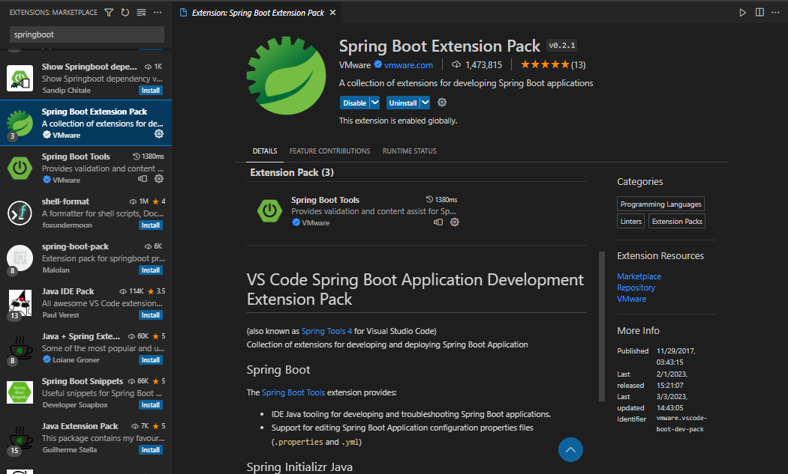
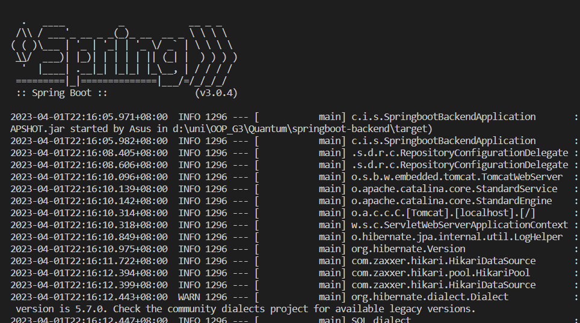
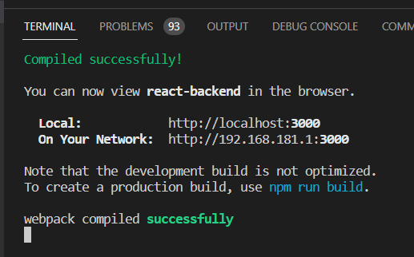
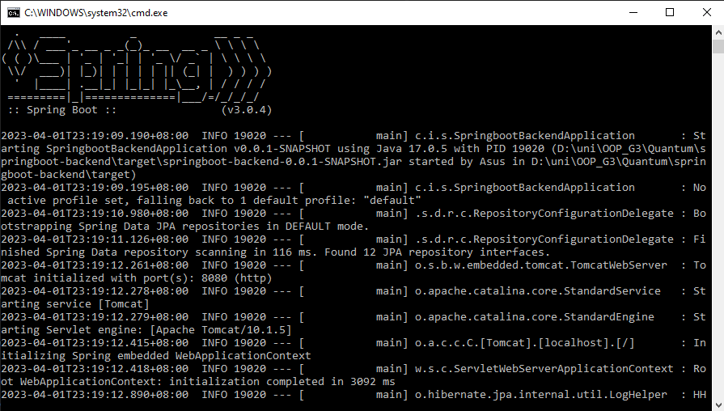
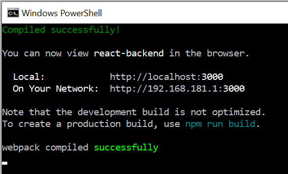

## IS442 G3 Team 3
Members:
- Sze To Ming Hong Brennan
- Muthukumar Sathish Kumar
- Teo Keith
- Yeo Jing Yi
- Nolin Ho Rui Ling
- Fok Jia Yi

## Setup Guide
### Method 1: Using Visual Studio Code (VSC)
Backend services:
1. Install Maven ( you can follow this [tutorial](http://https://www.tutorialspoint.com/maven/maven_environment_setup.htm "tutorial") to verify that your installation is correct )
2.  Install Spring Boot Extension Pack on VSC

3. Locate the file `SpringbootBackendApplication.java` under `springboot-backend\src\main\java\com\is442\springbootbackend\`
4. Right-click and run the file
5. You should see this in your terminal once the application has successfully been run  

Frontend application:
1. Install [node](https://nodejs.org/en "node")
2. Open a new terminal in VSC *(if you encounter npm command not found errors, try closing and reopening VSC)*
3. Navigate to the `react-frontend` folder
4. Run the `npm start` command
5. You should see this in your terminal and a new browser tab will open showing the login page

### Method 2: Running build.bat file
Backend services:
1. Install Maven ( you can follow this [tutorial](http://https://www.tutorialspoint.com/maven/maven_environment_setup.htm "tutorial") to verify that your installation is correct )
2. Locate the `build.bat` file under `springboot-backend` folder
3. Double-click and run the file
4. You should see this in the opened terminal once the application has successfully been run

Frontend application:
1. Install [node](https://nodejs.org/en "node")
2. Locate the `build.bat` file under `react-frontend` folder
3. Double-click and run the file
4. You should see this in the opened terminal and a new browser tab will open showing the login page

## Documentations
- [API Documentation](http://https://documenter.getpostman.com/view/17615314/2s93JtRisF "API Documentation")
- 

## Other third-party components/resources
### Email sending using Sendgrid
1. [Sign up for an account ](https://signup.sendgrid.com/ "Sign up for an account ")
2. Follow the integration guide to generate a new API key
3. Replace the Sendgrid API Key in the applications.properties file in the `springboot-backend` folder
